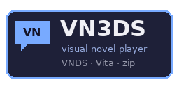
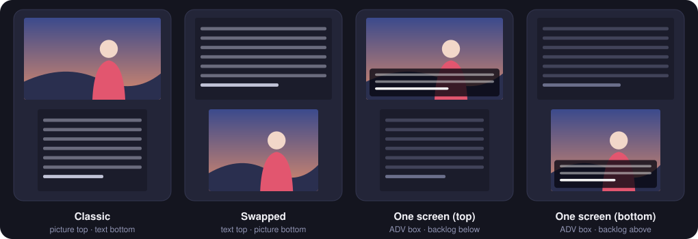

<div align="center">



### Плеер визуальных новелл для Nintendo 3DS. Открывает VNDS-новеллы от DS, PS Vita и Android-портов без конвертации.

[](https://github.com/Pedro8b/VN3DS/actions/workflows/build.yml)
[](https://github.com/Pedro8b/VN3DS/releases/latest)
[](https://github.com/Pedro8b/VN3DS/releases)

[](LICENSE)

[English](README.md) · **Русский**

</div>

---

VN3DS написан с нуля по мотивам [VNDS](https://github.com/BASLQC/vnds), это не порт старого DS-кода.
Кидаешь папку новеллы (или один `.zip`) на карту и жмёшь **A**. Как разложены файлы, в каких они форматах
и какого размера картинки, VN3DS разберётся сам.

## ✨ Главное

|  |  |
|---|---|
| 📂 **Любая структура VNDS** | Классические DS/Android-папки и zip, Vita-порты, Higurashi-Vita, новелла одним `.zip`, `.legArchive` и любая их смесь. Всё определяется автоматически |
| 🔊 **Почти любой звук** | Ogg Vorbis, MP3, AAC (ADTS, M4A/MP4, HE-AAC), WavPack, WAV (PCM/ADPCM), FLAC. Формат определяется по содержимому файла, а не по расширению |
| 🧩 **Поиск файлов по имени** | Если скрипт просит `music/s04.mp3`, а в новелле лежит `sound/music/s04.wv`, сыграет он. Регистр букв не важен |
| 🖼️ **Любые картинки** | PNG, JPEG, BMP, GIF, TGA, PSD в любом разрешении. Картинки заранее масштабируются под экран со сглаживанием и учётом прозрачности, режимы *Fit*, *Zoom* и *Stretch* |
| 🕶️ **Стерео-3D** | Фон уходит вглубь, персонажи стоят чуть ближе. Включается 3D-ползунком |
| 📱 **Четыре расположения экранов** | Классика DS, то же наоборот, или как в обычной новелле: окошко текста поверх картинки на любом из экранов |
| 🌸 **Родной Higurashi** | Скрипты Higurashi-Vita `Scripts/*.txt` исполняются встроенным Lua 5.1, есть переход по главам и TIPS |
| 💾 **Сохранения** | 30 слотов, быстрое сохранение и автосейв. Новелла открывается там, где ты остановился, а сейвы совместимы с VNDS на DS |
| ⏩ **Пропуск по строкам** | Если держать R, реплики пролетают по одной и всё быстрее. Есть эффект печатной машинки, автоматический режим и история текста |
| 🧹 **Чистка сконвертированных скриптов** | Остатки Ren'Py вроде `\n`, тегов `{i}`, кавычек вокруг реплик, `label …:` и имён-переменных убираются прямо при показе |

## 📥 Установка

1. Скачай последний релиз со страницы **[Releases](https://github.com/Pedro8b/VN3DS/releases/latest)**:
   - `VN3DS.cia`: ставится через **FBI**, иконка появится в HOME Menu;
   - `VN3DS.3dsx`: кинь в `sdmc:/3ds/` и запускай из **Homebrew Launcher**.

   Когда VN3DS появится в **Universal-Updater**, его можно будет поставить и оттуда.
2. Для звука нужен дамп DSP-прошивки `sdmc:/3ds/dspfirm.cdc`. Если его нет, один раз запусти [DSP1](https://github.com/zoogie/DSP1).
3. Закинь новеллы (см. ниже) и запускай.

Работает на Old 3DS / 2DS и New 3DS / 2DS XL. На New 3DS включаются режим 804 МГц и L2-кэш.

## 📚 Куда класть новеллы

Каждая новелла лежит в своей папке или одним `.zip` в любой из этих папок:

```
sdmc:/vnds/novels/          ← стандартное место
sdmc:/3ds/vnds/novels/
sdmc:/3ds/VN3DS/novels/
sdmc:/3ds/save/novels/
sdmc:/VNs/
```

Чтобы сканировались другие папки, добавь в `sdmc:/3ds/VN3DS/config.ini` по строке `noveldir=sdmc:/путь` на каждую.

### Какие структуры понимает

Ничего переименовывать и перепаковывать не нужно:

```
Классический VNDS (DS / Android)   Vita-порты / VNDSVitaConverter      Higurashi-Vita (родной)
────────────────────────────────   ──────────────────────────────      ───────────────────────
MyNovel/                           MyNovel/                            Higurashi ep 1/
├── script/ или script.zip         ├── Scripts/                        ├── Scripts/*.txt  (Lua)
├── background/ или .zip           ├── CG/  CGAlt/                     ├── CG/  CGAlt/
├── foreground/ или .zip           ├── BGM/  SE/  voice/               ├── BGM/  SE/  voice/
├── sound/ или sound.zip           ├── *.legArchive                    └── includedPreset.txt
├── img.ini  info.txt              ├── isvnds
├── thumbnail.png  default.ttf     └── (или всё внутри StreamingAssets/)
└── save/
```

- Внутри zip может быть одна папка верхнего уровня. Вложенные zip без сжатия читаются на месте.
- Если нет `main.scr`, новелла стартует с первого `.scr`. Так сделаны многие Vita-порты.
- У Higurashi-Vita главы берутся из `includedPreset.txt`, а в меню появляется пункт **Chapters / TIPS**.

<details>
<summary><b>vn3ds.ini: ручное описание нестандартной структуры</b></summary>

Если VN3DS не узнаёт, как разложена новелла, положи в её корень `vn3ds.ini`:

```ini
engine=vnds            ; или higurashi
main=start.scr         ; стартовый скрипт (для higurashi — имя без .txt)
script_dir=scripts2    ; дополнительные папки (через запятую), ищутся первыми
background_dir=bg_hd
foreground_dir=chara
sound_dir=bgm,se,voice
width=800              ; система координат спрайтов (как img.ini)
height=600
title=Моя новелла
alt_art=1              ; Higurashi: спрайты из CGAlt вместо CG
```

</details>

<details>
<summary><b>Как ищутся файлы</b></summary>

1. По точному имени во всех подходящих папках и архивах, без учёта регистра.
2. То же имя с любым поддерживаемым расширением (`bg/room.jpg` найдётся как `background/room.png`).
3. Имя без папки, а звуки ещё и в `voice/`, `se/`, `bgm/`, `music/`, `sound/`.

Декодер потом выбирается по первым байтам файла, так что `.ogg`, который на самом деле MP3, тоже сыграет.

</details>

## 🖥️ Расположение экранов

<p align="center"></p>

Переключается в **Меню → Settings → Screen layout**. В режимах «один экран» текст идёт в окошке поверх картинки,
второй экран показывает историю, а **B** прячет окошко, чтобы посмотреть на арт.

## 🎮 Управление

| Кнопка | В списке новелл | В новелле |
|---|---|---|
| **A** / тап | открыть | дальше / выбрать вариант |
| **R** (держать) | | промотка по строкам (чем дольше, тем быстрее) |
| **Y** | пересканировать карту | авточтение вкл/выкл |
| **X** / **START** | выход (START) | меню |
| **SELECT** | | быстрое сохранение |
| **B** | | спрятать/показать окошко текста (режимы «один экран») |
| **↑ / ↓**, стик, свайп | прокрутка | история текста |
| **3D-ползунок** | | глубина стереоэффекта |

В меню есть пункты Save, Load, Chapters/TIPS (для Higurashi), Auto mode, Skip to next choice, Settings,
Restart from the beginning и Exit to library.

## ⚙️ Настройки

| Настройка | Значения |
|---|---|
| Text speed | от очень медленно до мгновенно |
| Music / Sound volume | 0–100 % |
| Font size | 11–22 px (берётся `default.ttf` новеллы, недостающие символы — из DejaVu Sans) |
| Auto mode delay | 1–9 |
| 3D depth | выкл / слабо / средне / сильно |
| Screen fit | **Fit** (целиком, с полосами) · **Zoom** (на весь экран, края обрезаются) · **Stretch** (растянуть) |
| Screen layout | классика · наоборот · один экран сверху · один экран снизу |
| Sprites stand on the bottom edge | ставит персонажей на нижний край картинки, если им отрезает ноги. **Значение своё у каждой новеллы и хранится в её сейвах**: при загрузке сейва восстанавливается то, что было при сохранении |
| Autosave | каждые 2 минуты, перед выборами и при выходе |
| Continue from the last save | открывать новеллу с последнего сохранения |

## 💾 Сохранения и файлы

| Что | Где |
|---|---|
| Сейвы (новелла-папка) | `<новелла>/save/saveNN.sav` в XML-формате VNDS, их можно загрузить в VNDS на DS |
| Сейвы (новелла-zip) | `sdmc:/3ds/VN3DS/saves/<новелла>/` |
| Глобальные переменные | `global.sav` рядом с сейвами |
| Настройки | `sdmc:/3ds/VN3DS/config.ini` |
| Лог (прикладывай к багрепортам) | `sdmc:/3ds/VN3DS/log.txt` |

## 📜 Скрипты

- **VNDS `.scr`**: все команды VNDSx 1.4.9 (`text` с префиксами `~` `!` `@`, `bgload` с затуханием, `setimg`, `sound`, `music`, `choice`,
  `setvar`/`gsetvar`, вложенные `if`/`fi`, `jump` в файл и на метку, `label`/`goto`, `delay`, `random`, `cleartext`, `endscript`),
  подстановка `$var` и `{$var}`, кодировки UTF-8 (с BOM и без) и UTF-16. Неизвестные команды пропускаются и пишутся в лог.
- **Higurashi-Vita**: `OutputLine`, `DrawScene`, `DrawBustshot`, `DrawSprite`, `FadeBustshot`, `DrawFilm`, `ShakeScreen`,
  `PlayBGM`/`PlaySE`/`PlayVoice`, флаги, `CallScript` и многое другое на настоящих корутинах Lua 5.1.
- **Скрипты, сконвертированные из Ren'Py**, чистятся при показе: escape-последовательности, теги `{i}`/`{b}`/`{color}`/`{w}`,
  кавычки вокруг реплик, говорящие в виде `Имя: "…"` и протёкшие `label`.

## 🔨 Сборка

Нужен [devkitPro](https://devkitpro.org/wiki/Getting_Started) (devkitARM, libctru, citro2d) и такие портлибы:

```sh
dkp-pacman -S 3ds-dev 3ds-libvorbisidec 3ds-libogg 3ds-zlib 3ds-liblua51
make                  # → VN3DS.3dsx
bash build.sh cia     # → VN3DS.3dsx + VN3DS.cia (нужны makerom и bannertool в PATH)
```

На Windows эти команды запускаются из MSYS2 devkitPro. Каждый пуш собирается в [GitHub Actions](.github/workflows/build.yml),
а `.3dsx` и `.cia` можно скачать из артефактов сборки.

### Тесты на ПК

`tools/hosttest` собирает платформонезависимое ядро (VFS, декодеры, движки скриптов, сейвы) под Linux:

```sh
cd tools/hosttest && make
./hosttest scan  /path/to/novels               # что покажет список новелл
./hosttest run   /path/to/novel [steps]        # прогнать скрипты и декодировать все ресурсы
./hosttest audio file.wv out.wav               # декодировать звук
./hosttest image file.png 400 240 out.ppm      # декодировать и масштабировать картинку
```

## 🙏 Благодарности

- Оригинальному [**VNDS**](https://github.com/BASLQC/vnds), а также сообществам VNDS-Vita и Higurashi-Vita за форматы, которые VN3DS умеет читать.
- Библиотекам: stb_image / stb_truetype, dr_libs, Tremor, FAAD2, WavPack, Lua 5.1, zlib, шрифту DejaVu. Подробнее в [THIRD_PARTY.md](THIRD_PARTY.md).
- Автор: **[Pedro8b](https://github.com/Pedro8b)**.

## 📄 Лицензия

**GNU GPL v3** ([LICENSE](LICENSE)), потому что внутри FAAD2 под GPL. У сторонних компонентов свои лицензии.
Новеллы в комплект не входят. Играй только в то, на что у тебя есть права.
